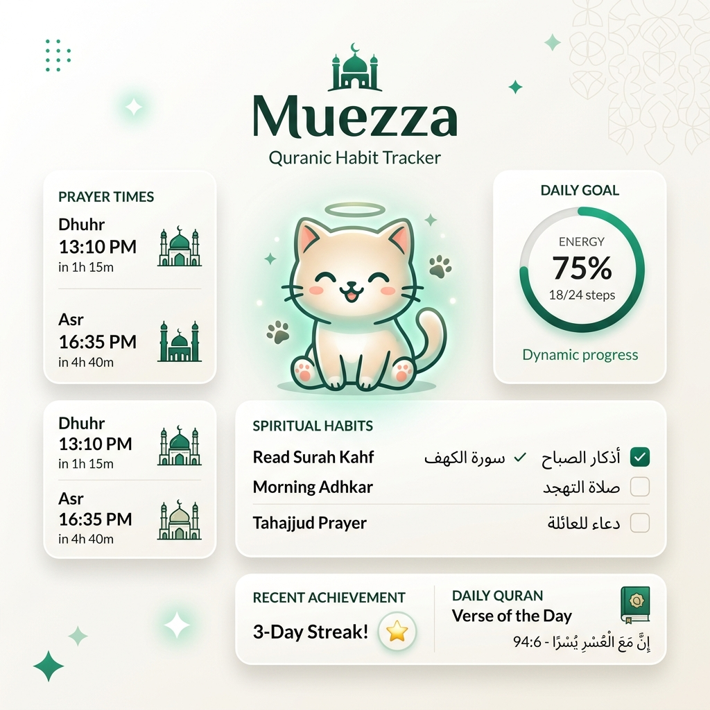

# Muezza: Grounded Quranic Habits
### [System Architecture v5.0 // Human Algorithm Protocol]

<p align="center">
  
</p>

## Product Philosophy

> *"Spiritual decay is rarely a crisis of faith; it is a crisis of friction. Most spiritual tools exist in isolation from the user's daily operational reality. Muezza serves as the **operational layer** for self-directed spiritual growth, where daily Islamic obligations converge with delightful, gamified motivation to eliminate cognitive debt."*

Muezza is a high-fidelity digital companion designed to transmute abstract spiritual intent into a structured, visible, and rewarding daily loop. Built on the **Human Algorithm** framework, the system utilizes a virtual pet (Muezza) to visualize a user's total spiritual energy across prayer, habits, and Quranic engagement.

---

## Architectural Topography

The system is engineered as a state-driven, client-heavy Progressive Web Application (PWA) deeply integrated with the **Quran Foundation v4 API Ecosystem**.

### I. The Content Substrate
*   **Quran Foundation Content API v4**: Orchestrates pristine Uthmani text, multi-translation delivery (Saheeh International), and real-time Tafsir streams.
*   **Audio CDN**: Streaming recitation loops via Quran Foundation's globally distributed content delivery network.
*   **Geolocation Substrate**: Real-time prayer timings via **Aladhan v1** with a manual city search fallback powered by **Nominatim**.
*   **Resilient Interface**: Zero-downtime loading via high-fidelity **Skeleton Loaders** and illustrative **Error Boundaries** to handle network partitions gracefully.

### II. Identity & Continuity
*   **OAuth2 PKCE Flow**: Secure, stateless authentication bridging Muezza with the global Quran.com user profile.
*   **Cloud Boundary**: Transactional synchronization of **Bookmarks** and **Noor Streaks**, ensuring spiritual continuity across any device.

### III. The Habit Engine
*   **Energy Memoization**: A derived reactive state aggregating 5 obligatory prayers and customizable Sunnah/Niyyah checklists into a 0–100% daily energy state.
*   **Evolution Logic**: Visual pet aging (Kitten → Adult → Majestic) computationally derived from historical streak length retrieved from the QF Streaks API.

---

## The Spiritual Loop [Operational Model]

Muezza operates on a continuous, self-reinforcing grounding loop:

1.  **Check-in**: System initializes state, resetting daily energy and surfacing contextual prayer timings. If a missed day is detected, the **Niyyah Protocol** triggers a Morning Reflection (Daily Wisdom).
2.  **Convergence**: The user completes obligatory and sunnah tasks, yielding **Dinar** (virtual currency) and filling the global energy gauge.
3.  **Immersion**: Native Quran Reader allows for deep reading, audio streaming, and "Ask Muezza" (Tafsir Insight) interactions.
4.  **Preservation**: Bookmarks and Streaks are committed to the Quran Foundation cloud, hardening the user's spiritual profile.
5.  **Delight**: Dinar is liquidated in the **Souq** to acquire equippable SVG assets for the mascot character.

---

## Operational Protocols

### Prerequisites
- **Node.js**: v18.0.0 or higher
- **Runtime**: npm or yarn

### Local Ignition
```bash
# 1. Initialize dependencies
npm install

# 2. Configure environment substrate
# Create .env.local and populate with Quran Foundation Developer keys:
# VITE_QURAN_CLIENT_ID="[Your Client ID]"
# VITE_QURAN_CLIENT_SECRET="[Your Client Secret]"

# 3. Boot development server
npm run dev
```

### Verification & Convergence
Before merging any architectural changes, ensure the following convergence checks pass:
- ✅ **Build Integrity**: `npm run build` succeeds without lint or type errors.
- ✅ **OAuth Readiness**: Redirect URIs are dynamically sanitized and match the target domain.
- ✅ **Legal Compliance**: Privacy and Terms pages are reachable at `/privacy` and `/terms`.

---

## Deployment Vector

The system is optimized for **Vercel Edge Runtime**. 
- Serverless functions handle secure `/api/token` and `/api/tafsir` orchestration.
- Deployment is automated via Git-trigger on the `main` branch.

**Live Application:** [muezza-app.vercel.app](https://muezza-app.vercel.app/)

---

> [!TIP]
> **Engineering with Intention.** Built for the Quran Foundation Hackathon (Shawwal 1447).  
> **Credit:** [Fadly Uzzaki](https://fadlyzaki-design.vercel.app/)
