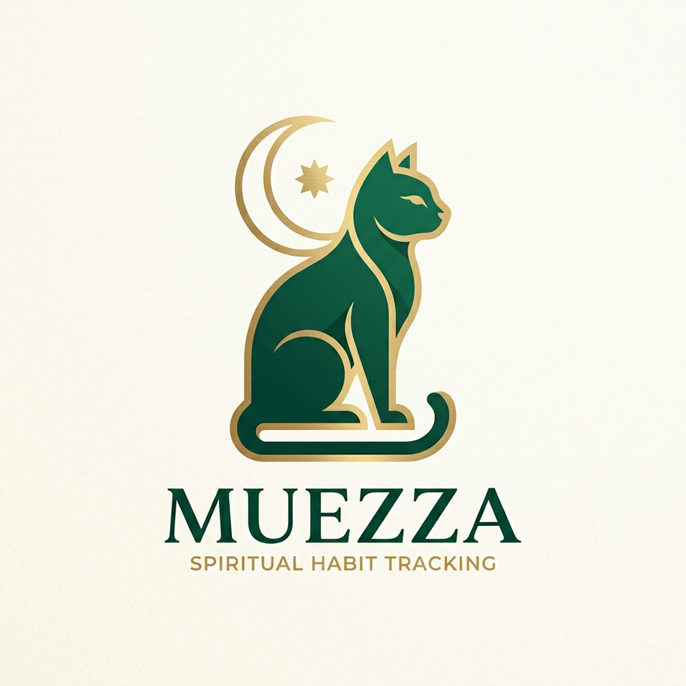

# Muezza: Grounded Quranic Habits

  

> **Product Philosophy:** *"Spiritual habits break down not because people lack faith or intention, but because the daily structure around that intention is often disconnected. Muezza is not just another utility or a disconnected Quran app. It is an operational layer for self-directed spiritual growth, where daily Islamic obligations meet delightful, gamified motivation with as little cognitive friction as possible."*

Welcome to **Muezza**: a digital companion that transforms abstract spiritual goals into a structured, visible, and rewarding daily loop. Built around a Tamagotchi-inspired virtual cat (Muezza), the app dynamically visualizes your spiritual energy through the completion of prayers, habits, and Quranic engagement. 

---

## Architectural Topography & Core Runtime

The current system is built as a state-driven, client-heavy mobile-first web application fully integrated with the Quran Foundation v4 APIs.

* **The Interface**: **React 19 + Vite + Tailwind CSS v4**  
  A fluid single-page application orchestrating the pet's state, daily checklists, and Quran reading experiences.
* **Authentication & Sync**: **Quran Foundation OAuth2 PKCE**  
  True cloud-sync capabilities utilizing the Quran Foundation's `/oauth2/auth` and serverless `/api/token` exchange to maintain user identity.
* **The Content Engine**: **Quran Foundation Content API v4**  
  Serves pristine Uthmani text alongside Sahih International translations, real-time Tafsir streams, and CDN-backed audio recitations.
* **User Data Layer**: **Quran Foundation User APIs**  
  Direct read/write capabilities for the user's **Bookmarks** and **Streaks**, seamlessly blending local-storage loops with authenticated cloud state.
* **The Deployment Substrate**: **Vercel Edge & Serverless**  
  The repository is optimized for Vercel, integrating frontend SPA routing with Node.js serverless functions for secure token exchange.

---

## The Spiritual Loop

Muezza is designed around one continuous, grounding loop rather than an isolated set of productivity tools:

1. A user checks in and is greeted by Muezza, whose energy state reflects the user's current daily progress.
2. The system surfaces the 5 obligatory prayers (synced to local time zones) and editable daily Sunnah habits.
3. Every completed action yields **Dinar** (currency) and raises the global energy state.
4. The user seamlessly drops into the deeply integrated Quran reader, featuring native Verse Audio and Tafsir via "Ask Muezza".
5. In the reader, the user can sync their saved Bookmarks directly to their global Quran.com account.
6. The user completes their actions for the day, advancing their **Noor Streak** (synced via the QF Streaks API).
7. Earned Dinar can be spent in the Souq to purchase custom hats and items for Muezza.

---

## Sub-Systems & Product Surfaces

### 1. Dynamic Energy Engine (The Pet)
Muezza's visual state is a derived memoization aggregating habit and prayer completion into a 0-100% "energy" gauge, smoothly transitioning from asleep to awake. 

### 2. Obligatory & Sunnah Checklists
Context-aware checklists track task completion and auto-calculate local prayer times gracefully formatting the core dashboard.

### 3. Native Quran Reader
A clean, focused reading environment fetching chapter metadata and verse-by-verse data. **Now equipped with live audio streaming from the Quran CDN and real-time authentic Tafsir pulls.**

### 4. Cloud Bookmarking Boundaries
The bookmark system acts as the trusted boundary for writes to the user's main Quran.com profile, ensuring continuity when switching contexts to standard Quran platforms.

### 5. Evolution Timeline (Noor Streaks)
Streaks are gamified into spiritual stages that physically transform Muezza's appearance (Kitten → Adult → Majestic). The app reads the user's historical streak length from the QF Streaks API and derives the visual stage, complete with "Noor glows" and angelic presence for high-streak users.

---

## System Behavior Under Constraint

A resilient system should not collapse the moment an external API or network is constrained:
- If the user is unauthenticated, the entire app functions gracefully utilizing `localStorage`.
- If an API rate-limits or times out, the app silently falls back to local data and cached error boundaries.
- State is synchronized resiliently so the user is never blocked from their daily habits due to a network partition.

---

## Local Ignition Protocol

### Prerequisites
- Node.js 18+
- npm

### Setup
1. `npm install`
2. `cp .env.local.example .env.local`
3. Add required values supplied by the Quran Foundation Developer Portal:
   - `VITE_QURAN_CLIENT_ID`
   - `QURAN_CLIENT_SECRET`
   - `VITE_QURAN_API_BASE=https://oauth2.quran.foundation`
   - `VITE_APP_URL=http://localhost:5173`
4. `npm run dev`

---

## Deployment Protocol

The repository is fully primed for **Vercel** serverless deployment. Configure Environment Variables in the Vercel Dashboard to match your Production Quran Foundation Application keys. Ensure your Redirect URI matches your Vercel domain.

---

**Engineered with intention for the Quran Foundation Hackathon**  
*Muezza — Grounded Quranic Habits.*
